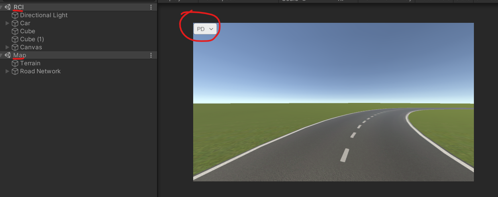

## RC_UI

RC_UI is a Unity project that contains the user interface for controlling the remote vehicle in the simulation.

### Installation
To get started, follow these steps:

1. Install Unity version 2020.3.31f1.

### Operating Instructions

Follow these instructions to run the user interface:

1. Open the RCI scene in the Assets folder, along with the Map scene in the same folder.
2. Use the toggle menu in the top-left corner to switch between different modes:

    * WO - Without mitigation method.
    * PD - With Predictive Display enabled.
    * VPD - With Virtual Predictive Display enabled.

The following image shows the toggle menu and the required scenes:

