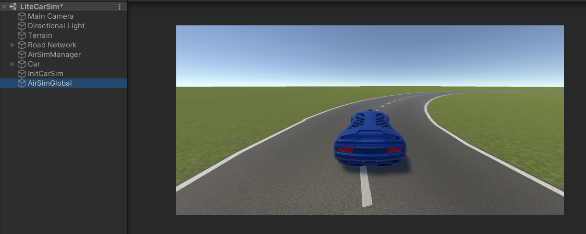

## VR_CarSim

A Unity project that simulates the physics of the vehicle based on AirSim.

### Installation
To get started, follow these steps:

1. Install Unity version 2020.3.31f1.

### Operating Instructions

Follow these instructions to run the simulation:

1. Run the LiteCarSim scene in the Assets/Scenes folder

The following image shows the required scene:

