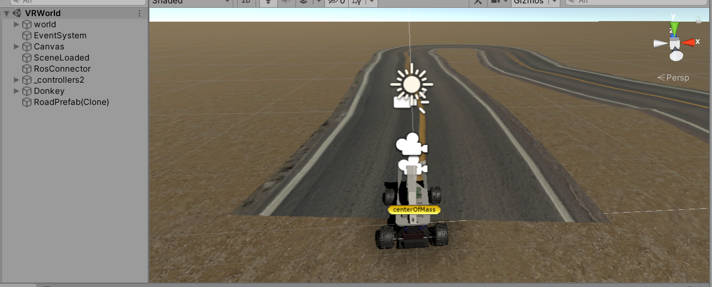

## VR_remote_control_car_client

VR_remote_control_car_client is a Unity project that includes the user interface for controlling the scaled-down vehicle.

### Installation
To get started, follow these steps:

1. Install Unity version 2020.3.31f1.

### Operating Instructions

Follow these instructions to run the simulation:

1. Connect the Oculus Rift S and the Logitech G29 Driving Force Steering Wheels & Pedals to the computer.
2. Run the VRWorld scene in the Assets/Scenes folder to control the scaled-down vehicle in a virtual environment.
3. Run the CarControllers scene in the Assets/Scenes folder to control the scaled-down vehicle using the 360 camera.

The following image shows the required scene:

